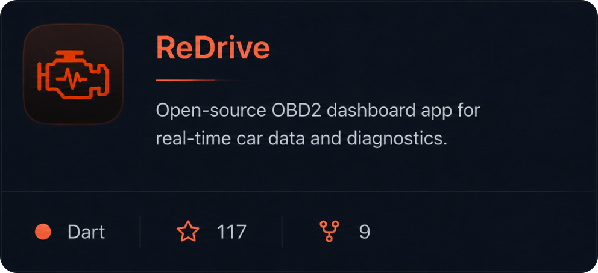
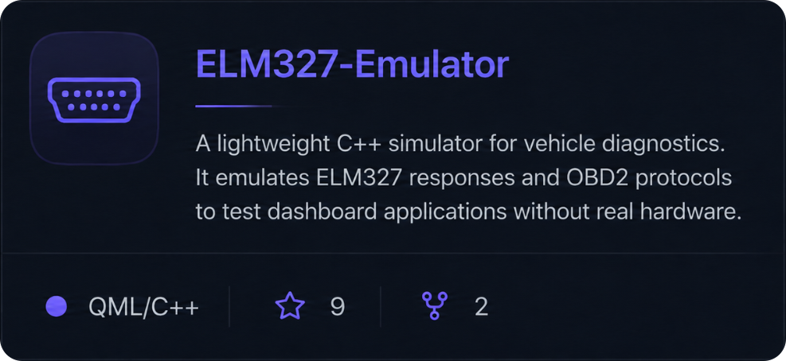

<picture>
  <source media="(prefers-color-scheme: dark)" srcset="./assets/header-dark.png">
  
</picture>

## About

I build practical software at the intersection of **cross-platform product development** and **systems engineering**. My work spans automotive diagnostics, desktop simulators, mobile tooling, and AI-assisted workflows.

My goal is simple: hide technical complexity behind interfaces that feel fast, clear, and useful.

## Featured work

  
  

## Toolbox

<table>
<tr>
<td width="155" valign="middle">
  <b>CORE STACK</b> 
  Primary technologies
</td>
<td valign="middle">
  
  
  
  
  
</td>
</tr>

<tr>
<td width="155" valign="middle">
  <b>ENGINEERING</b> 
  Build & infrastructure
</td>
<td valign="middle">
  
  
  
  
  
  
  
</td>
</tr>

<tr>
<td width="155" valign="middle">
  <b>AUTOMATION</b> 
  Platforms tooling
</td>
<td valign="middle">
  
  
  
  
  
  
</td>
</tr>
</table>

## GitHub activity

  

## Principles

- **Product over decoration** - every feature should solve a real problem.
- **Clarity over complexity** - architecture should scale without making the interface harder to use.
- **Automation over repetition** - routine work belongs in tools, not in someone's daily checklist.

## Contact

The fastest way to reach me is on **Telegram: [@unreallx](https://t.me/unreallx)** or in **X (Twitter): [@unreallxz](https://x.com/Unreallxz)**

